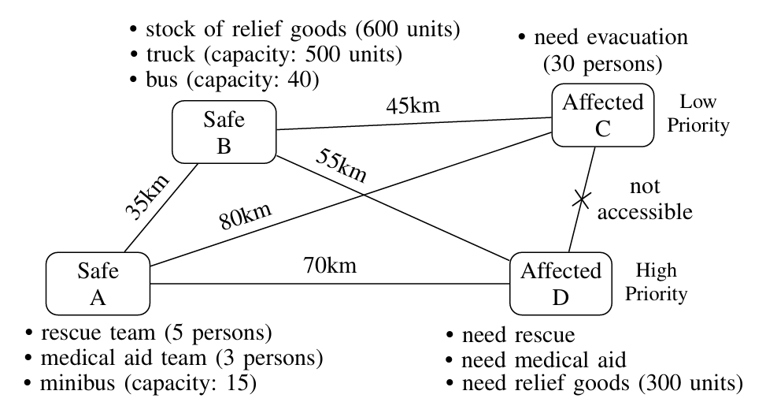

RAPID: Resilient Automated Planning for Intelligent Disaster Response
=======================================================================

# Abstract

<div style="text-align: justify ">
An efficient disaster response plan is necessary for affected areas to recover quickly and with fewer fatalities. Automated planning is an area of artificial intelligence (AI) that finds a plan efficiently, considering relevant aspects of a problem. This work advances the field of automated planning for disaster response by offering a systematic and computationally effective framework for organizing resilience efforts during disasters. We formalize a domain using the planning domain definition language (PDDL) to use automated planning in various disaster resilience scenarios. Our proposed domain includes important activities like evacuation, rescue, medical support, and resource distribution. The domain allows prioritization of affected areas and considers various constraints such as the accessibility of a location and the capacity of different vehicles. The domain uses elegant PDDL components, for example, quantified preconditions and conditional effects, to incorporate those constraints. This domain is flexible to apply in various types of crises, such as floods and cyclones. We found plans with up to 279 actions for various instances of our domain with differing levels of complexity within a time limit of 30 minutes using a numeric planner, which explored over 1 million states to find the plan. A numeric planner with the proposed domain can generate plans that reduce response time and operational cost for disaster response and resilience planning.
</div>
<br>

# Introduction
<div style="text-align: justify ">
Rapid response is one of the keys to reducing losses in catastrophes. Traditional crisis management techniques, which rely primarily on human judgment and often struggle with resource allocation and response priority setting, often result in delays and more casualties. Disaster management is an essential field focused on reducing fatalities and financial losses during disastrous events. It encompasses strategies for readiness, reaction, restoration, and prevention. Effective disaster response requires rapid decision-making and excellent coordination. Large-scale disasters can render traditional disaster management methods ineffective; thus, more flexible and computationally efficient solutions are required. The use of artificial intelligence-powered automated planning methods is a viable way to overcome these obstacles. Automated planning can greatly improve disaster resilience efficiency by reducing response times and considering cost-effectiveness. To support automated decision-making in disaster scenarios, we propose a domain in this work utilizing the planning domain definition language (PDDL). Affected locations, safe locations, specialized teams, vehicles, consumable resources, and other related aspects for disaster response and resilience are included in this domain. The domain takes into account real-world constraints (e.g., accessibility), cost-effectiveness, and priority-based decision-making.

<br>
To demonstrate the capabilities of the proposed method, consider a scenario with two safe (A, B) and two affected locations (C, D) as shown in Figure 1. Safe locations offer teams, vehicles, and relief goods, and affected locations require evacuation, rescue, aid, and supplies. Constraints like travel distances and inaccessible routes reflect real-world challenges such as resource limits, priority handling, and accessibility issues. The proposed method can generate cost-effective plans with effectively address these constraints and challenges.

<br>

<div align="center">
  <br>
  <div style="display: inline-block; text-align: justify">
  Figure 1: An example scenario illustrating safe and affected locations, available resources, required responses, and inter-location accessibility with distances.
  </div>
</div>
<br>

This automated planning domain can be integrated into real-world disaster response systems through a layered architecture involving instance formulation, plan generation, and execution. This would include interfacing the planner with data sources through a preprocessing layer that formats inputs into a PDDL instance. Authorities can embed a numeric planner along with the proposed domain within their Command-and-Control software to generate plans for evacuation, rescue, medical support, and resource distribution based on data. This model can also serve as a component of Digital Twin systems for disaster scenarios, where simulations help train personnel, stress-test strategies, and prepare for future crises.
</div>
<br>

# Details
## License

This project is licensed under the [Creative Commons Attribution-NonCommercial 4.0 International License](https://creativecommons.org/licenses/by-nc/4.0/). ([LICENSE](LICENSE))

## Manual

To get started with RAPID, follow these steps:

### Prerequisites

1. PDDL-compatible numeric planner, e.g.
      - [ENHSP: Expressive Numeric Heuristic Search Planner](https://sites.google.com/view/enhsp/)
     - [Metric-FF](https://fai.cs.uni-saarland.de/hoffmann/metric-ff.html)
2. A basic understanding of PDDL syntax and planning systems.

### How to Use

1. Clone this repository

   ```bash
   git clone https://github.com/rmimbd/rapid.git
   ```

   or simply download the raw Domain ([domain.pddl](domain.pddl)) file.

2. Define your problem instance files in PDDL. You can find sample instances here ([instances](instances/)).

3. Run your planner with the domain and problem files to generate a sequence of actions.

## Contributing

We welcome contributions to RAPID! If you have ideas, bug fixes, or improvements, feel free to fork the repository and submit a pull request.

### Steps to contribute

1. Fork the repository.
2. Create a new branch for your feature or bug fix.
3. Make your changes and commit them with descriptive messages.
4. Push your changes to your forked repository.
5. Submit a pull request with a description of your changes.

## Contact

For any questions, suggestions, or support, feel free to open an issue or contact the repository owner at <rmimbd@outlook.com>.
